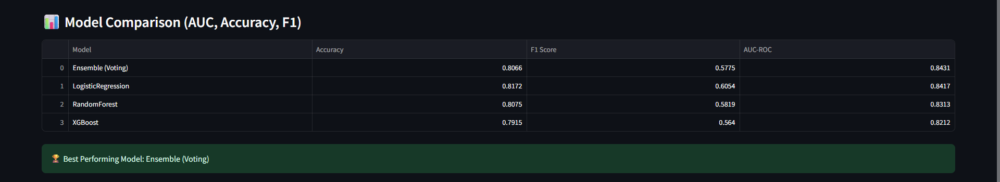

# Churn Prediction Dashboard 🚀

A machine learning-powered dashboard for predicting customer churn. This project covers everything from **data preprocessing** to **model building**, **evaluation**, and a **Streamlit-based dashboard** for visual insights and predictions.

---

## 📌 Overview

Customer churn is a major issue in many industries. This project uses machine learning models to predict the likelihood of churn based on customer data. It includes preprocessing pipelines, model training (Logistic Regression, Random Forest, XGBoost), an ensemble model, and SHAP-based explainability.

---

## 📁 Directory Structure

```
v41bh4vr4jput-churm-prediction/
├── README.md
├── requirements.txt             # Dependencies
├── app/                         # Streamlit app
│   └── dashboard.py
├── Data/                        # Final and raw datasets
│   ├── Data.csv
│   ├── hidden_data.csv
│   └── processed_train.csv
├── Models/                      # Trained models and encoders
│   ├── Ensemble_model.pkl
│   ├── label_encoders.pkl
│   ├── LogisticRegression_churn_model.pkl
│   ├── LogisticRegression_model.pkl
│   ├── RandomForest_model.pkl
│   ├── scaler.pkl
│   └── XGBoost_model.pkl
├── NoteBook/                    # Exploratory notebooks
│   ├── PreProcessing.ipynb
│   ├── Data.csv
│   ├── hidden_data.csv
│   └── processed_train.csv
├── reports/                     # Model performance metrics
│   └── metrics.csv
└── utils/                       # Utility functions
    ├── model_utils.py
    ├── preprocessing.py
    └── shap_explain.py
```

---

## 🧠 ML Models Used

* Logistic Regression
* Random Forest Classifier
* XGBoost Classifier
* Ensemble Voting Classifier

Each model is trained, validated, and saved in `.pkl` format for deployment.

---

## 📊 Model Performance

Performance metrics (accuracy, precision, recall, F1 score, ROC AUC) are stored in `reports/metrics.csv`. SHAP is used for explaining feature contributions.




---

## 🖥️ Dashboard Features

* Built using **Streamlit**
* Upload data 
* View model predictions (churn or not churn)
* Visualize SHAP values for model interpretability


---

## ⚙️ Setup Instructions

### 🔽 Clone the repository

```bash
git clone https://github.com/your-username/v41bh4vr4jput-churm-prediction.git
cd v41bh4vr4jput-churm-prediction
```

### 📦 Install dependencies

```bash
pip install -r requirements.txt
```

### 🚀 Launch the dashboard

```bash
streamlit run app/dashboard.py
```

Open in browser: `http://localhost:8501`

---


